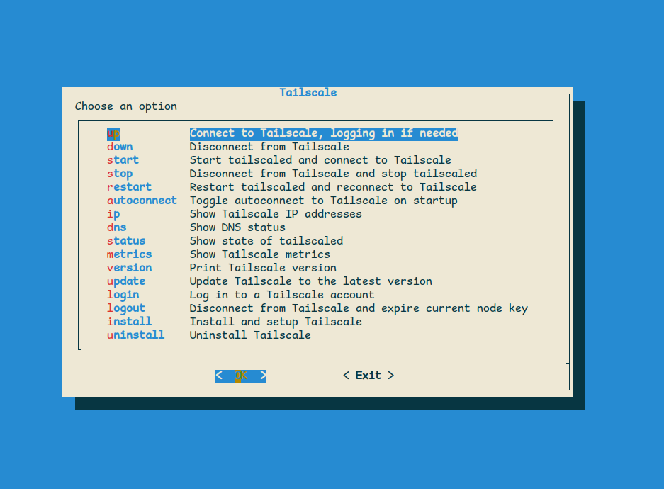

# MiSTer-tailscale

A script and menu system for running Tailscale on your MiSTer.



## Prerequisites

* An Internet connected MiSTer
* A [Tailscale](https://login.tailscale.com/start) account

## Setup

1. Add the following to `/media/fat/downloader.ini`.

```ini
[davewongillies/tailscale]
db_url = https://raw.githubusercontent.com/davewongillies/MiSTer-tailscale/db/db.json.zip
```

2. Run `update` or `update_all` from the Scripts menu.
3. From the Scripts menu run `tailscale`.
4. The `tailscale` script will install and setup Tailscale for the first time. A
   URL and QR code will be printed on the screen for you to log your MiSTer onto
   Tailscale.
